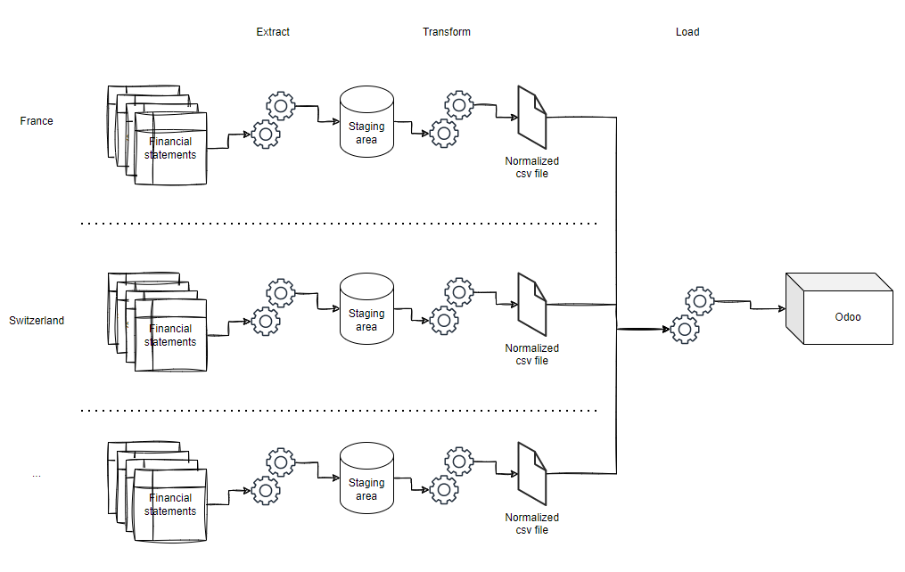

# Accounting data

The loader which is pushing data to Odoo is expecting the following input format:

city_identifier (text)
year (int)
account (text)
debit (float)
credit (float)

debit and credit must be in the currency of the city's country (eg EUR for France, CHF for Switzerland..)

